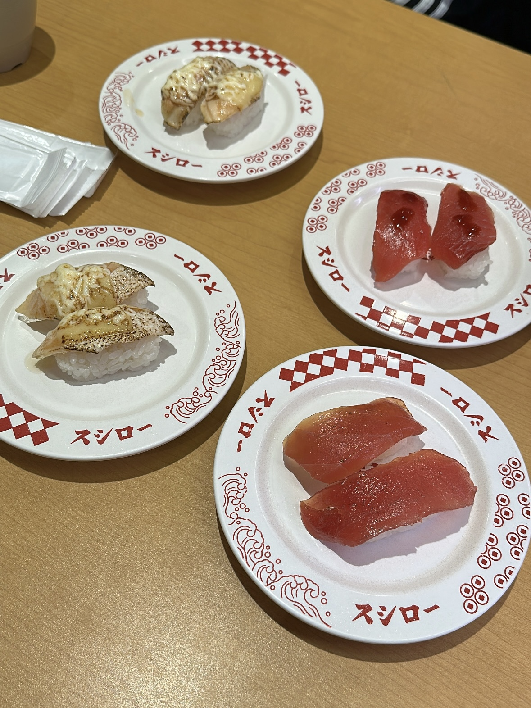
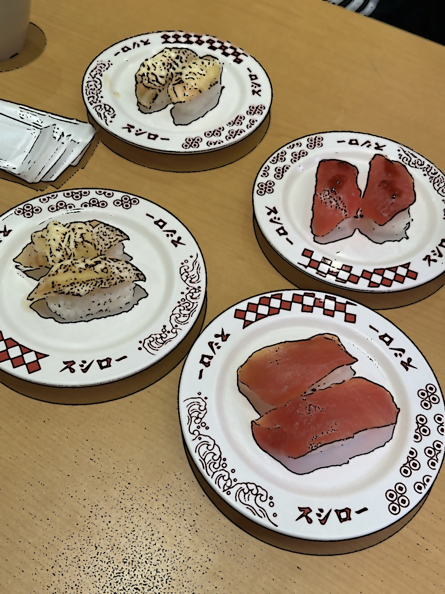
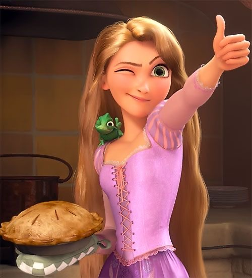
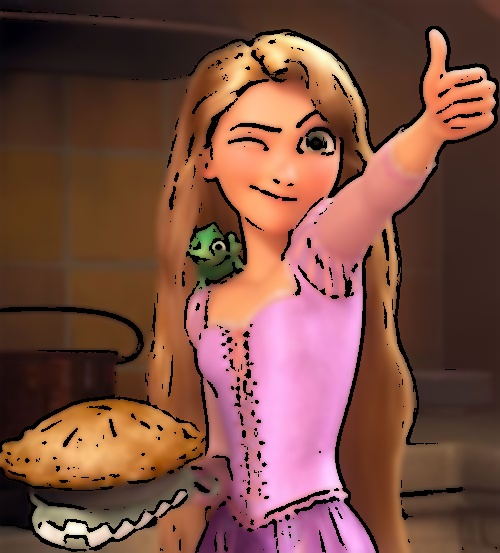

# 🖼️ Cartoonify OpenCV

A simple Python project that converts images into a cartoon-style effect using **OpenCV**.  
This project demonstrates how edge detection and color smoothing can be combined to create non-photorealistic rendering.

---

## 📌 Overview

This program takes an input image and transforms it into a cartoon-like version by:

- Detecting edges
- Smoothing colors
- Combining both into a stylized output

It is a lightweight and beginner-friendly implementation of a **cartoon rendering pipeline**.

---

## ⚙️ How It Works

The algorithm follows these steps:

### 1. Preprocessing
- Convert the image to grayscale  
- Apply median blur to reduce noise  

### 2. Edge Detection
- Use **adaptive thresholding** to extract edges  

### 3. Color Smoothing
- Apply **bilateral filtering** to smooth colors while preserving edges  

### 4. Combine Results
- Merge the edge mask with the smoothed image  

---

## 🧪 Example Output

### Totoro Image
| Original | Cartoon |
|----------|--------|
|  |  |

### Sushi Image
| Original | Cartoon |
|----------|--------|
|  |  |

### Tangled Image
| Original | Cartoon |
|----------|--------|
|  |  |

---

## ❗ Why Results Look Different on Different Images

This algorithm does **not produce identical quality for all images**.  
The output depends heavily on the characteristics of the input image.

### 🧠 Key Factors

#### 1. Texture Complexity
- Images with **many details (e.g., trees, leaves, fur)**  
  → produce **too many edges** → noisy cartoon effect  

- Images with **simple shapes (e.g., objects, food)**  
  → produce **clean and clear cartoon results**

---

#### 2. Lighting and Contrast
- High contrast → strong, clear edges  
- Low contrast → weak edge detection  

---

#### 3. Image Style (Real vs Animated)
- Real-world photos → work well  
- Already animated images → may look **over-smoothed or flat**

---

### 📊 Summary

| Image Type            | Result Quality | Reason |
|----------------------|--------------|--------|
| Complex scenes       | Medium       | Too many edges (noise) |
| Simple objects       | Best         | Clear shapes |
| Cartoon/animation    | Weak         | Lack of strong edges |

---

## 🚀 Installation

```bash
pip install opencv-python numpy
